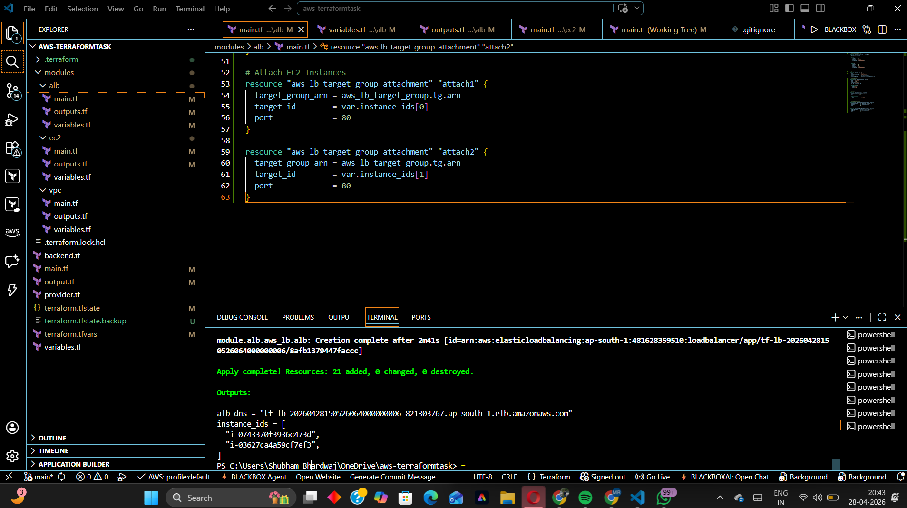

This project creates AWS infrastructure using Terraform:
* VPC
* Public and Private Subnets
* EC2 Instances (Web Servers)
* Application Load Balancer (ALB)

bash
terraform init
terraform plan
terraform apply

After applying, Terraform provides an ALB DNS:

tf-lb-xxxx.ap-south-1.elb.amazonaws.com

When opening the ALB DNS in browser:

This site can’t be reached
ERR_CONNECTION_REFUSED
This issue occurred because:

* ALB listener was not properly configured
* Target group was missing or not attached
* EC2 instances were not correctly connected

Due to this, the ALB was not accepting incoming requests.
## Terraform Apply Output

## Website Output
